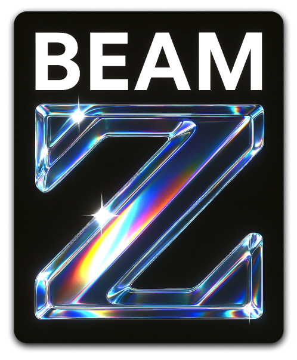

<div align="left">


BEAMZ is a GPU-accelerated **electromagnetic simulation** package using the FDTD method. It features a **high-level API** that enables fast prototyping and parametric design with just a few lines of code, made for (but not limited to) photonic integrated circuits.
</div>

```bash
pip install beamz
```


## Notable Features
+ **[FDTD simulation]()** in 2D & 3D operating at 99% of the Courant limit.
+ 100x speed-up with **[GPU-acceleration using Jax]()** + general CPU-support with Numpy.
+ High level **[Python API]()** for scripting.
+ **[GDSII]()** file import and export.
+ Powerful and intuitive **[procedural design]()** module.
+ **[Interactive visualization]()** for the design and simulation.
+ Custom current sources with arbitrary time and spatial profile, including Gaussian beams and a mode launcher for waveguides and planewaves.
+ **[Frequency-domain eigensolver]()** for finding resonant modes.
+ **[Subpixel smoothing]()** for improved accuracy.
+ **[PML]()** absorbing boundaries.
+ Field analyses including energy density.

---

+ [ ] Materials library containing predefined broadband, complex refractive indices.
+ [ ] Adjoint solver for inverse design and topology optimization.
+ [ ] Fabrication-aware design module (including iso- and anistropic etching).

## +20 Examples / Documentation
[The BEAMZ documentation](https://wwww.quentinwach.com/beamz) provides details for all the physics and algorithms behind BEAMZ, including various examples like:
+ [Ring-Resonator]()
+ [50/50 MMI Splitter]()
+ [Efficient, Hirarchical DEMUX Design using the Adjoint Method]()
+ [Dipole with Dielectric Rectangle]()

Apart from reproducing results in the literature ([see examples](https://wwww.quentinwach.com/beamz)), there are multiple tests and benchmarks set up to ensure [physical accuracy and competitive performance]().


## Citing BEAMZ
Please cite the following paper in any published work for which you used BEAMZ as
>Quentin Wach, _BEAMZ: A Free Software Package for GPU-Acclerated Electromagnetic Simulations by the FDTD Method_, Computer Physics Communications, 2025.

or using the `BIBTEX`:
```
@article{beamz2025,
    authors = {Quentin Wach},
    title = {BEAMZ: A Free Software Package for GPU-Acclerated Electromagnetic FDTD Simulations and Fabrication-Aware Design},
    year = {2025}
}
```

## Coming in **v0.1.7**
+ Export of field histories as VDB and HDH5.
+ Bloch-periodic and perfect-conductor boundary conditions.
+ Variety of arbitrary material types: 
    - Dispersive ε(ω) and μ(ω) including loss/gain
    - Nonlinear (Kerr & Pockels) dielectric and magnetic materials
    - Electric/magnetic conductivities σ
    - Saturable gain/absorption
    - Anisotropic electric permittivity ε and magnetic permeability μ
    - Gyrotropic media (magneto-optical effects).
+ Exploitation of symmetries to reduce the computation size, including even/odd mirror planes and 90°/180° rotations.
+ Field analyses including 
    - discrete-time Fourier transform (DTFT)
    - Poynting flux
    - mode decomposition (for S-parameters)
    - energy density
    - near to far transformation
    - frequency extraction
    - local density of states (LDOS)
    - modal volume
    - scattering cross section
    - Maxwell stress tensor
    - absorbed power density
    - arbitrary functions, completely programmable.

**BEAMZ Public License (BPL-1.0)**

**Copyright (c) 2025 Quentin Wach**

This license governs the use of the BEAMZ software ("the Software"). By using, modifying, or distributing the Software, you agree to the terms below.

---

### 1. **Grant of Use**

You are granted a non-exclusive, worldwide, royalty-free license to use, copy, modify, and distribute the Software, subject to the following conditions:

#### a. **Private and Academic Use**

* You may use the Software free of charge for **private**, **personal**, or **academic** purposes.
* Academic use includes use by students, educators, and researchers at universities or public research institutions, including use in academic publications and coursework.

#### b. **Commercial Use – Revenue Limit**

* You may also use the Software free of charge **in a commercial or industrial context** as long as your **total annual revenue** (or your organization’s total annual revenue) **does not exceed €250,000** (or equivalent in your local currency).

#### c. **Commercial Use – Licensing Required**

* If your total annual revenue exceeds €250,000 and the Software is used in your commercial or industrial workflows, you **must obtain a commercial license** by reaching an agreement with the Software's creator, **Quentin Wach**.
* The licensing terms, including the monthly fee, will be determined on a case-by-case basis.

---

### 2. **Modifications and Derivative Works**

* You may create and distribute modified versions or derivative works of the Software, provided that:

  * They comply with this license.
  * You include a notice stating that changes were made and retain attribution to the original author (Quentin Wach).
  * You clearly indicate which parts were modified.

---

### 3. **Redistribution**

* You may redistribute the Software (original or modified), provided that this license is included in full with any distribution and remains applicable to the redistributed Software.
* You may not sublicense the Software under a different license.

---

### 4. **Attribution**

All copies, modifications, and substantial portions of the Software must include the following attribution (e.g., in a README or documentation):

```
BEAMZ is developed by Quentin Wach. Licensed under the BEAMZ Public License (BPL-1.0).
```

---

### 5. **No Warranty**

THE SOFTWARE IS PROVIDED "AS IS", WITHOUT WARRANTY OF ANY KIND, EXPRESS OR IMPLIED. THE AUTHOR SHALL NOT BE LIABLE FOR ANY CLAIM, DAMAGES, OR OTHER LIABILITY ARISING FROM THE USE OF THE SOFTWARE.

---

### 6. **Contact for Licensing**

For commercial licensing inquiries, contact **[quentin.wach@gmail.com](mailto:quentin.wach@gmail.com)** (or your preferred contact method).


Here’s a curated list of **cool places to advertise cool open-source projects**, especially if you want visibility, contributors, or even just feedback and community around your work:

---

### 🧑‍💻 Developer Communities & Forums

* **[Hacker News](https://news.ycombinator.com/)** – Post on “Show HN” if your project is ready for users.
* **[Reddit](https://www.reddit.com/)** – Subreddits like:

  * r/opensource
  * r/programming
  * r/coding
  * r/rust, r/python, r/machinelearning (language/topic specific)
  * r/selfhosted (for deployable apps)
* **[Lobsters](https://lobste.rs/)** – Tech-focused community similar to Hacker News but more curated.
* **[Dev.to](https://dev.to/)** – Write a blog post introducing your project.
* **[Stack Overflow](https://stackoverflow.com/)** – Don’t advertise, but answer questions and mention your project if it's relevant.
* **[GitHub Discussions](https://github.com/discussions)** – If you have other popular repos, mention your new project in pinned discussions.

---

### 📦 Open Source Ecosystem Hubs

* **[GitHub Explore](https://github.com/explore)** – Tag your project well; it may get featured.
* **[Awesome Lists](https://github.com/sindresorhus/awesome)** – Add your project to a relevant curated “Awesome List.”
* **[LibHunt](https://www.libhunt.com/)** – Add your project under the right category.
* **[Open Source Collective](https://opencollective.com/opensource)** – For community funding and visibility.
* **[Awesome-OpenSource](https://awesomeopensource.com/)** – Directory that crawls GitHub.

---

### 📣 Social Media

* **Twitter/X** – Use hashtags like `#opensource`, `#buildinpublic`, and tag related communities.
* **LinkedIn** – Great for showing off serious projects, especially if they apply to research or industry.
* **YouTube** – Make a short demo video or walkthrough.
* **TikTok** – Surprisingly good for getting traction with devs if your project has a visual or quirky angle.
* **Mastodon** – Many devs have moved there; join a dev-focused instance like fosstodon.org.

---

### 🧪 Specialized Platforms

* **[Product Hunt](https://www.producthunt.com/)** – Has an “open source” tag. Great if your project is somewhat polished or has a UI.
* **[Indie Hackers](https://www.indiehackers.com/)** – Share if you're building an open-source tool as part of a business or dev journey.
* **[Betalist](https://betalist.com/)** – Early exposure for tools/startups.
* **[Open Source Friday](https://opensourcefriday.com/)** – Initiative by GitHub to encourage contributions.
* **[DevPost](https://devpost.com/)** – Especially if your project spun out of a hackathon.

---

### 🧑‍🏫 Blogs & Newsletters

* **[Changelog](https://changelog.com/)** – Submit your project for podcast or newsletter feature.
* **[GitHub ReadMe Project](https://github.blog/tag/readme-project/)** – Spotlight for interesting open-source projects.
* **[Telescope](https://telescope.cdot.systems/)** – Aggregator for posts about open-source development.
* **Personal Blog** – Post on Medium, Hashnode, or your own blog and cross-share to Reddit and Dev.to.

---

### 🧑‍🤝‍🧑 Contributing Platforms

* **[CodeTriage](https://www.codetriage.com/)** – Helps devs find projects to contribute to.
* **[First Contributions](https://firstcontributions.github.io/)** – Add your repo for beginners to contribute to.
* **[Good First Issue](https://goodfirstissue.dev/)** – Tag your GitHub issues appropriately to appear here.
* **[Up For Grabs](https://up-for-grabs.net/)** – Showcase beginner-friendly projects.

---

Want personalized suggestions based on what your open-source project does (e.g., dev tools, AI, photonics, etc.)? Let me know what it's about!
