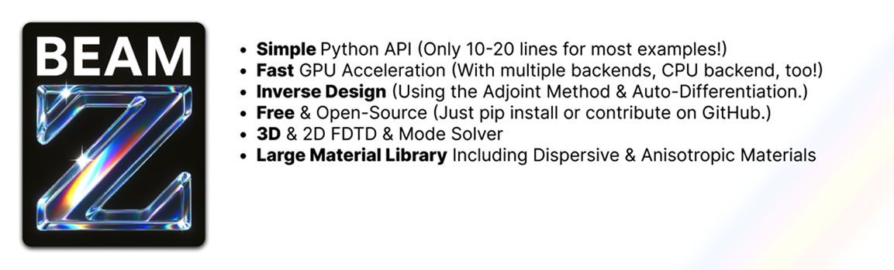

# Generative Nanophotonic Design for Humans

BeamZ is a multi-backend EM-simulation and optimization framework, with support for Numpy, JAX, and PyTorch. Its high-level API allows for most simulations and designs to be created in just a few lines of code, ideal for engineering, while access to low-level functionality makes BeamZ a playground to develop new research ideas.

```bash
pip install beamz
```

+ **Accelerated device development**: Develop highly optimized solutions faster thanks to the high-level UX.
+ **Advanced physics**: Don't limit yourself to non-dispersive, lossless, linear, isotopric materials. Beamz includes complex materials and a large library of presets.
+ **State-of-the-art performance**: By picking the backend that is the fastest for your model architecture (often JAX!), leverage speedups ranging from 20% to 350% compared to other frameworks. Benchmark here.


## Backends
+ Numpy (CPU)
+ PyTorch (CPU & GPU)
+ CUDA (GPU)
+ Directly on the metal of the GPU