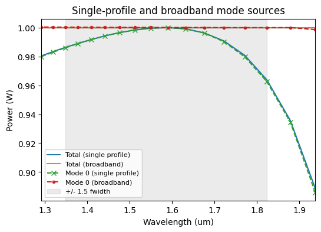
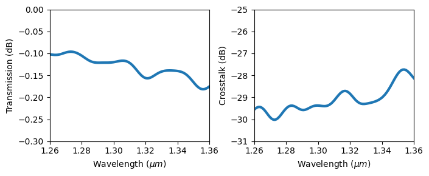

# Full notebook regression checks

Both notebooks executed top-to-bottom without errors, using their original cells
and full settings (`BEAMZ_DOCS_TEST` unset). Each was run on the unchanged
`ee092cb61f5209ae38a1ee74ea788cc60ee69f6d` checkout and again with the material
snapshot correction. No regression was detected in the checks below.

The environment was the local RTX 3090, Python 3.11, JAX 0.9.0, and the native
`cuda_streamed` backend, extension 0.21.0 / ABI 21. Both checkouts used the same
native extension binary, SHA256
`f9e97a391c377fe8a892577b048f318143d768fed3377ef253b9e36907defc5b`.
That binary was reused from a local checkout with identical CUDA sources and
CMake configuration. Notebook hashes, production Python file hashes, array
hashes, shapes, differences, and small numerical arrays are recorded in
[notebook-validation.json](notebook-validation.json).

## Modal sources and monitors

Full rectilinear grid: 180 × 77 × 56 cells, 12,605 steps for each of the three
simulations, 17 monitor frequencies, seven broadband source profiles, and three
candidate modes. The single-profile guide, broadband guide, and width-step
junction all executed successfully.

- Raw and source-normalized recorded fields and flux are **exactly identical**
  before and after the fix. Source-mode effective indices and profile frequencies
  are also exactly identical.
- Modal coefficients change as expected when the analysis receives the actual
  material coefficients. These are not required to equal the defective baseline.
- All exported arrays are finite. In the notebook's broadband design band,
  fundamental-mode power stays within 0.001 W of 1 W; backward power and absolute
  unresolved signed flux are each below 0.001 W.

| Broadband design-band quantity | Baseline | Corrected |
|---|---:|---:|
| Minimum fundamental forward power (W) | 0.999654786 | 0.999961025 |
| Maximum fundamental forward power (W) | 1.000217251 | 1.000267899 |
| Maximum backward modal power (W) | 0.000287426 | 0.000298451 |
| Maximum absolute unresolved signed flux (W) | 0.000332787 | 0.000078042 |

At the junction's central frequency, forward mode-0 power changes from
0.710845962 to 0.710132457 W and mode-2 power from 0.249555171 to 0.250179674 W.
The maximum absolute change in any plotted junction modal power across the
spectrum is 0.001582085 W. The recorded junction fields and flux remain exactly
unchanged. This is a change in decomposition, not propagation.



## Cosine waveguide crossing

Full uniform grid: 384 × 384 × 56 cells, 14,695 steps, and 101 wavelengths from
1.26 to 1.36 µm. All exported arrays are finite and **exactly identical** between
baseline and candidate, including raw Ex/Ey/Ez fields, raw and normalized port
flux, source power, source-mode indices, transmission, and crosstalk.

At 1.31 µm:

| Quantity | Baseline | Corrected |
|---|---:|---:|
| Transmission (dB) | -0.121511499 | -0.121511499 |
| Crosstalk relative to through power (dB) | -29.155149191 | -29.155149191 |

Across the full band, transmission ranges from -0.181697 to -0.096224 dB and
crosstalk from -30.023072 to -27.735764 dB. This notebook uses flux monitors, so
it checks source and propagation preservation rather than the corrected modal
estimator itself. Numerical equality is a regression result, not an independent
accuracy or mesh-convergence certificate.



## Reproduce and inspect

Run in the CUDA-enabled contributor environment with the native extension
available to each checkout:

```bash
JAX_PLATFORMS=cuda OPENBLAS_NUM_THREADS=1 python scripts/validate_modal_notebook.py \
  --root "$PWD" --output validation-artifacts/modal-candidate --expected-device 'RTX 3090'
JAX_PLATFORMS=cuda OPENBLAS_NUM_THREADS=1 python scripts/validate_crossing_notebook.py \
  --root "$PWD" --output validation-artifacts/crossing-candidate
```

Repeat with `--root` pointing to an unchanged checkout and distinct output
directories. Each runner appends an export cell without changing the original
notebook cells, verifies the imported checkout and GPU backend, and saves the
executed notebook, raw numerical arrays, and provenance. Output directories must
not already exist.

The executed notebooks and numerical archives from this review are retained
locally under `validation-artifacts/issue-309-notebooks/`, in `modal-baseline`,
`modal-fixed`, `crossing-baseline`, and `crossing-fixed`. The original example
notebooks were not modified. Every code cell executed; there were no error
outputs. All ten modal and five crossing PNG outputs were inspected directly
for layout, labels, fields, and spectra. HTML previews were generated, but the
T3 browser preview failed to open, so a full HTML-layout check was unavailable.
