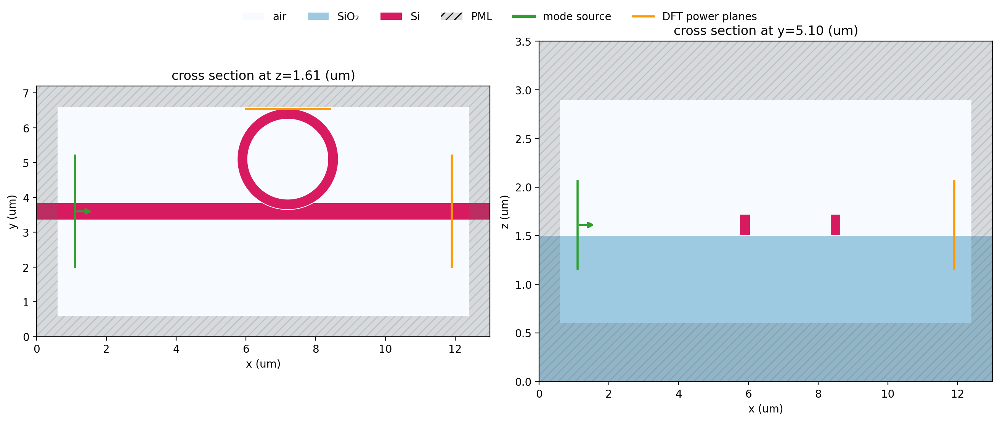
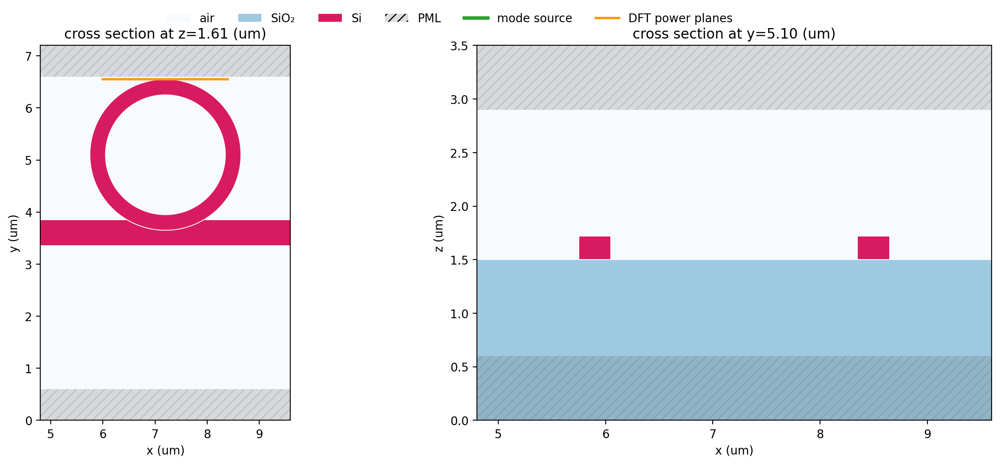

# Smooth simulation setup cross sections

`Simulation.plot(z=..., y=...)` now draws a native `Design` directly as
antialiased vector geometry. This is the setup view: polygons, rings, material
regions, PML bands, sources, and monitors are shown without exposing the FDTD
cell grid. `categorical_cross_sections=False` remains available when the
rasterized permittivity itself is the thing to inspect.

The example below uses a deliberately coarse `resolution`; the ring is still
smooth because the layout view never compiles or samples the numerical grid.
Saving the returned figure as SVG or PDF preserves those geometry paths as vector
artwork.

```python
from runpy import run_path

demo = run_path("examples/3D_basics/smooth_cross_sections.py")
fig, axes = demo["plot_setup"]()
```



The vertical cut keeps holes and disjoint spans intact. Here the ring is a pair
of silicon spans around its air centre, rather than a stair-stepped raster mask.



See [the complete example](https://github.com/beamzorg/beamz/blob/main/examples/3D_basics/smooth_cross_sections.py)
for the simulation definition, legend, and image-generation code.
