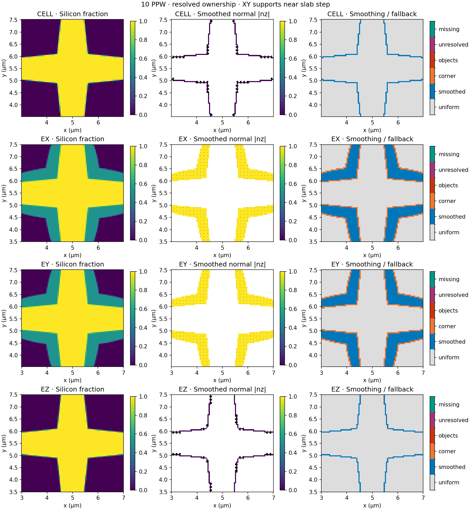
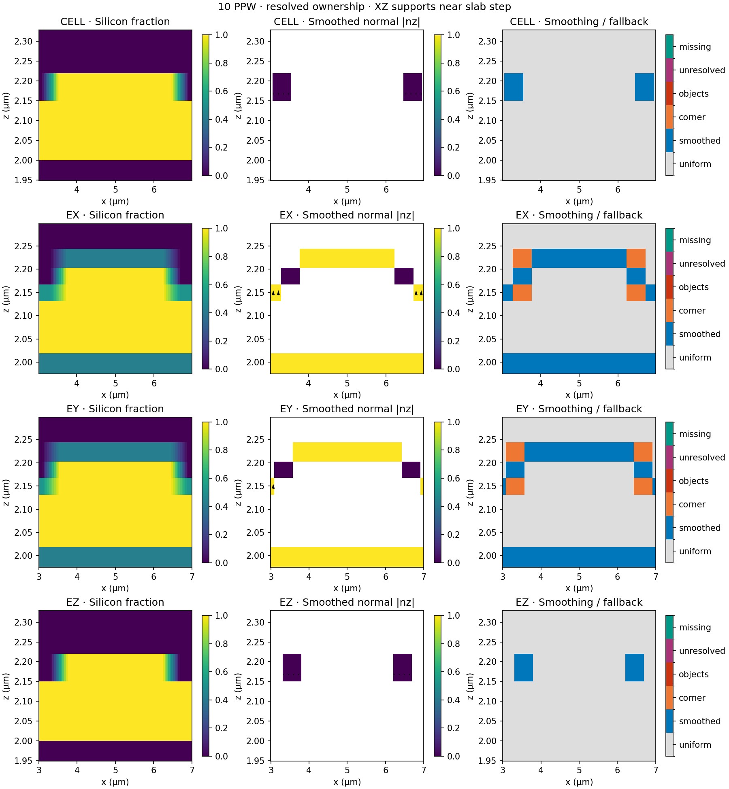

# Material ownership correction: issue #242

The native rasterizer now integrates the physical material union of boxes and
straight extruded polygons, including different heights, holes, and priority
occlusion. Exposed interfaces determine smoothing. Duplicates and hidden
same-material seams do not change the constitutive problem.

The issue's half-filled 45° cell gives diagonal epsilon
`[5.321071, 5.321071, 7.085414]` for one, two, or three identical objects.
The tests also compare every returned electric, magnetic, conductivity, and
node tensor across overlapping and disjoint core/slab decompositions.

## Crossing S parameters

Four fresh-process RTX 3090 runs use the crossing adapter and case manifest at
[PR #230, 372143da](https://github.com/teevee112/beamz/tree/372143daea1a8203965bc74947deb6345763ab6a/tests/differential).
Baseline native source: `5e5ffdeee362421a8e0c92f6ff136e4fc9dfdbd1`.
Corrected native source: `f0d2b685` (ownership implementation plus numerical
alignment correction). Python solver and CUDA sources are identical in both.

| PPW | Realized grid | Before through power | After through power | Change (percentage points) | Existing reference check |
| --- | --- | ---: | ---: | ---: | --- |
| 10 | 226 × 249 × 45 | 96.537844% | 96.028320% | -0.509524 | fail → pass |
| 15 | 339 × 372 × 66 | 96.222757% | 95.858731% | -0.364026 | fail → pass |

The through phase changes by 11.338648° at 10 PPW and 6.929921° at 15 PPW
at the central frequency. Across the sampled spectrum, maximum `|ΔS(o3,o1)|`
is 0.193889 and 0.118474 respectively; the full complex changes are retained
alongside the power comparison.

The reference is the pinned benchmark's converged nominal, 0.9571666667.
Its existing same-PPW acceptance intervals are 0.954000–0.960333 at 10 PPW
and 0.955333–0.959000 at 15 PPW. No benchmark tolerance was changed.
These two runs establish an improvement at the tested settings; they do not
establish asymptotic convergence or agreement at untested resolutions.

[measurements.json](measurements.json) contains the full complex S spectra,
power spectra, before/after differences, termination outcomes, source and
monitor positions, and SHA-256 hashes of all three realized grid axes, time
samples, and source signals. Those hashes and physical settings match between
before and after at each PPW. Both runs use balanced/diagonal rasterization,
a 20-nm source, the pinned sponge absorber, and the adapter's termination rule
(`field_decay=1e-5`, no monitor-change threshold, one consecutive check).
All incident-power validity masks pass. The nearest wavelength to 1550 nm is
approximately 1549.935 nm, as in the pinned benchmark.

Environment: Linux, Python 3.11.15, JAX/JAXlib/CUDA13 plugin 0.9.0,
NumPy 2.4.1, SciPy 1.17.0, GDSFactory 8.18.2, Shapely 2.1.2;
NVIDIA RTX 3090, driver 610.43.03, `cuda_streamed` backend. GPU allocation
settings were `XLA_PYTHON_CLIENT_PREALLOCATE=false` and
`XLA_PYTHON_CLIENT_MEM_FRACTION=0.80`. Timings include shared-desktop activity
and are not isolated performance measurements.

## Spatial evidence and denominators

The figures inspect actual cell, Ex, Ey, and Ez supports on the **10-PPW**
realized grid. XY slices select x=3–7 µm, y=3.5–7.5 µm near the 2.15-µm slab
top. XZ slices select x=3–7 µm, z=1.95–2.3 µm near y=6 µm. Coordinates are
BeamZ domain coordinates: silicon starts at z=2 µm; slab/core heights are
150/220 nm. Each component uses its own staggered coordinates; exact selected
indices and plane positions are in [spatial_selection.json](spatial_selection.json).
The figures preserve nonuniform support widths. Normal arrows are sign-invariant
axes, and the color gives |nz|; blank normal pixels are uniform or unsmoothed.





| Component | Unique selected supports | Mixed supports | Smoothed | Corner fallback |
| --- | ---: | ---: | ---: | ---: |
| Cell | 8,820 | 300 | 300 | 0 |
| Ex | 8,730 | 2,554 | 2,044 | 510 |
| Ey | 8,827 | 2,574 | 2,060 | 514 |
| Ez | 8,918 | 298 | 294 | 4 |

These are **35,295 selected supports**, deduplicated where the two slices
intersect. Counts are neither whole-domain physical-cell percentages nor
field-energy-weighted errors. Multiple-object, missing-evidence, and unresolved
fallback counts are zero in this selection. Multiple exposed orientations at
slab and core corners still fall back to volume averaging.

The independent GEOS ownership calculation checks all selected support
fractions: maximum absolute difference is `1.253094e-6`; the 95th percentile
is `2.220446e-16`. [spatial_summary.json](spatial_summary.json) retains the
counts and errors. The generated JSONL additionally records all fractions,
three normal components, epsilon, support bounds, and fallback reasons.
Large raw inspection files remain in ignored `validation-artifacts/`.

## Scope and validation

Exact polygon integration is limited by the underlying Boolean overlay's
roughly 29-bit XY lattice and float32 coefficient outputs. Input-coordinate
restoration and analytic rectangle/interior clipping avoid false interfaces
at aligned supports. Tests cover unit and micrometer coordinates, full and
diagonal tensors, nonuniform grids, background occlusion, material aliases,
holes, thin layers, hidden corners, decomposition, ordering, and duplication.
The regression tolerance is `2e-6` for the tested constitutive tensors; exact
uniformity and mirror symmetry are also checked without relaxing tolerances.

Overlaps involving curved, tapered, or mesh unions retain conservative adaptive
fallback. Identical occluded primitives are removed, and an unrelated curved
object does not disable exact extrusion integration in other supports. The
adaptive disagreement estimator has not become a rigorous error bound.

Validation on the final implementation:

- `make audit`: **1,128 passed, 1 expected failure, 47 deselected**; Ruff,
  formatting, Pyright, Vulture, and every coverage gate pass (85.03% global,
  91.41% solver core).
- `cargo test --workspace`: **41 passed**; the opt-in inspection test is ignored
  during the ordinary suite and passed separately on the selected crossing supports.
- `cargo clippy --workspace --all-targets -- -D warnings` and
  `cargo fmt --all -- --check`: pass.
- `make build`: wheel and source distribution built and passed distribution checks.
- 28 focused ownership regressions pass, including exact uniformity and mirror
  symmetry. The full audit also verifies the simulation-facing mode-source,
  reciprocity, and boundary checks.
- Four CUDA crossing runs completed; both corrected results pass the unchanged
  pinned reference intervals, and their realized numerical settings match baseline.

## Reproduce

Use a BeamZ environment with the versions above and its optional native CUDA
component. Save a release-built `_native.abi3.so` from the baseline revision in
a separate checkout as `$before_native`; keep this checkout on the corrected
revision. Extract the pinned benchmark helper files without changing this tree:

```bash
benchdir="$PWD/validation-artifacts/issue-242/benchmark"
mkdir -p "$benchdir"
git fetch https://github.com/teevee112/beamz.git 372143daea1a8203965bc74947deb6345763ab6a
git archive 372143daea1a8203965bc74947deb6345763ab6a \
  tests/differential/passive_soi \
  tests/differential/cases/passive_soi_crossing.json \
  tests/differential/cases/passive_soi_directional_coupler.json | tar -x -C "$benchdir"
export XLA_PYTHON_CLIENT_PREALLOCATE=false
export XLA_PYTHON_CLIENT_MEM_FRACTION=0.80
for ppw in 10 15; do
  python scripts/benchmark_raster_ownership.py --benchmark-root "$benchdir" \
    --native "$before_native" --ppw "$ppw" \
    --output "validation-artifacts/issue-242/before-${ppw}ppw"
  python scripts/benchmark_raster_ownership.py --benchmark-root "$benchdir" \
    --ppw "$ppw" --output "validation-artifacts/issue-242/after-${ppw}ppw"
done
python scripts/inspect_raster_ownership.py \
  --run validation-artifacts/issue-242/after-10ppw \
  --output validation-artifacts/issue-242/spatial
```

The inspection command invokes an ignored Rust test to expose selected internal
integration results. Production rasterization allocates no dense diagnostic
arrays, and the public Python API is unchanged.
