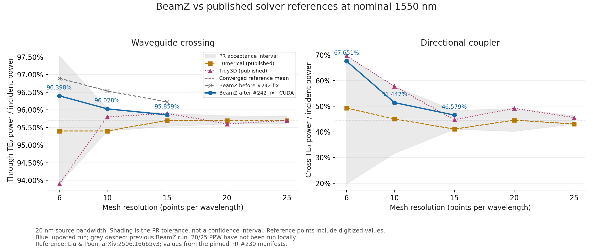
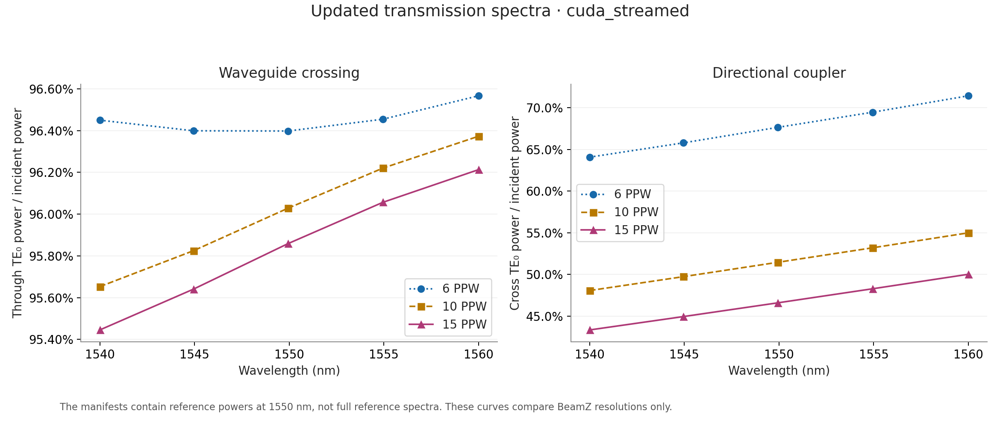
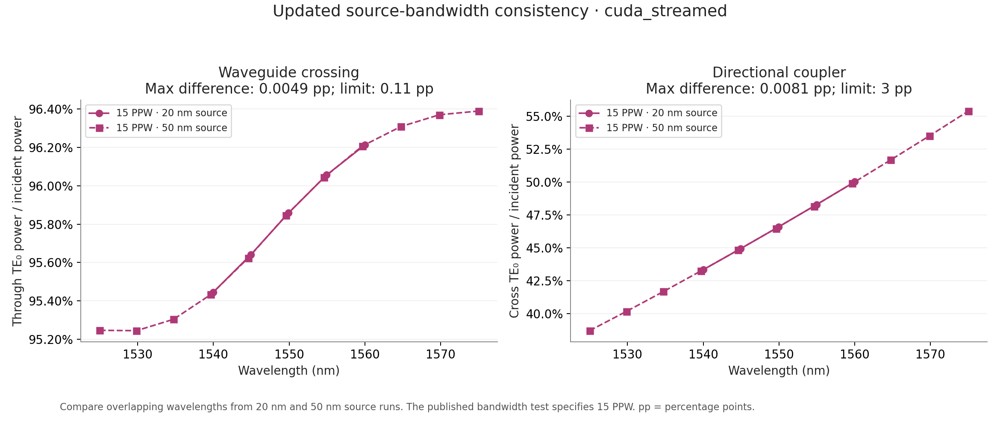

# RTX 3090 benchmark rerun after the material-ownership fix

Eight fresh-process `cuda_streamed` simulations on PR head `29f327762bb93c2eb7cf3cf08e9ed2467c39b914`, after merging the #242 fix through #244. Both devices ran at 6/10/15 PPW with a 20-nm source, and at 15 PPW with a 50-nm source. The Rust raster extension was rebuilt from this checkout. CUDA and Python solver sources, benchmark inputs, and acceptance tolerances are unchanged from the previous run.

## Reference comparison and change from the previous run

Powers and intervals are fractions of incident power; change is in percentage points (pp). The nominal references remain 0.957166667 for crossing and 0.447333333 for coupler. Values use the adapter's nearest sample to 1550 nm (approximately 1549.935 nm for a 20-nm source).

| Device | PPW | Before #242 | After #242 | Change (pp) | Acceptance interval | Result |
| --- | ---: | ---: | ---: | ---: | ---: | --- |
| Crossing through | 6 | 0.968965 | 0.963981 | -0.4984 | 0.939000–0.975333 | pass |
| Crossing through | 10 | 0.965378 | 0.960283 | -0.5095 | 0.954000–0.960333 | pass |
| Crossing through | 15 | 0.962228 | 0.958587 | -0.3640 | 0.955333–0.959000 | pass |
| Coupler cross | 6 | 0.676243 | 0.676506 | +0.0263 | 0.197667–0.697000 | pass |
| Coupler cross | 10 | 0.514445 | 0.514467 | +0.0022 | 0.316667–0.578000 | pass |
| Coupler cross | 15 | 0.465779 | 0.465793 | +0.0014 | 0.411000–0.483667 | pass |



The shaded region is the existing PR acceptance interval, not statistical confidence. Grey dashed markers show the previous BeamZ run; blue markers show this rerun. The 20/25-PPW points belong to published references only. Passing these intervals does not establish asymptotic convergence. The 10-PPW crossing is particularly close to its upper acceptance bound.

## Transmission spectra



The manifests provide reference powers at 1550 nm, not complete reference spectra; these curves compare the updated BeamZ resolutions only.

## Source-bandwidth consistency at 15 PPW

| Device | Previous max difference | Updated max difference | Limit | Result |
| --- | ---: | ---: | ---: | --- |
| Crossing | 0.000057175 | 0.000048669 | 0.0011 | pass |
| Directional Coupler | 0.000081275 | 0.000080791 | 0.03 | pass |


Differences and limits are absolute power fractions. Each comparison uses interpolation on the common wavelength range, following the existing benchmark protocol.



## Validation and provenance

- All eight saved monitor archives contain finite numerical arrays and all incident-power validity masks pass.
- All eight simulations report `converged`; all applicable secondary output-power/loss checks pass.
- The updated 10-PPW crossing hardware test passes directly through pytest (`cuda_streamed`, 31.62 s), after removing its obsolete strict-xfail marker.
- Peak whole-device GPU memory: **17.76 GiB**, including desktop usage, sampled once per second.
- 34 ownership/PDK regression tests and 10 non-hardware benchmark tests pass.
- Results retain each simulation's termination reason, grid shape, step count, runtime, wall time, package versions, and extension hashes in [measurements.json](measurements.json). See [summary.csv](summary.csv) for the six primary comparisons.
- Full raw monitor archives, per-run environment/memory samples, logs, and PDF plots are retained locally in `validation-artifacts/pr230-rtx3090` in the rerun checkout.
- [Previous benchmark evidence](../rtx3090-2026-09-15/README.md) remains preserved. [Ownership-fix diagnostics](../issue-242/README.md) document the underlying change.

20/25 PPW remain untested locally. These are shared-desktop runs, so timing changes are not controlled hardware-performance measurements. BeamZ still uses fixed indices at 1550 nm, its own grid and diagonal smoothing, and documented port/boundary differences. Contour-path averaging is not implemented by this fix; see #243.

## Reproduction

Use GPU-enabled JAX and BeamZ's native CUDA component, rebuild the native raster extension from the tested commit, and run each device/resolution in a fresh process:

```sh
XLA_PYTHON_CLIENT_PREALLOCATE=false \
XLA_PYTHON_CLIENT_MEM_FRACTION=0.80 \
BEAMZ_EXECUTION_BACKEND=cuda_streamed \
BEAMZ_VALIDATION_ARTIFACT_DIR=validation-artifacts \
python -m pytest tests/differential/test_crossing.py \
  -m hardware -k 6ppw --validation-report=validation-results-crossing-6ppw.json
```

Select `10ppw` or `15ppw`, or `test_directional_coupler.py`, for the remaining power cases. Select `spectrum_is_consistent` for the 15-PPW bandwidth tests. Direct adapter calls with an explicit backend were used for this report, preserving every comparison independently of pytest expected-failure handling.
